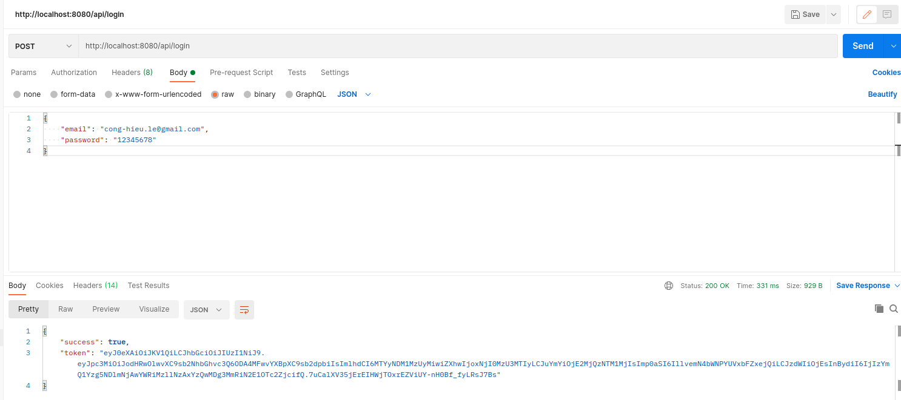
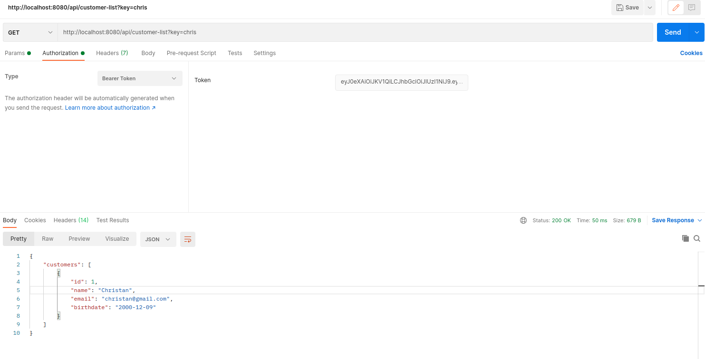

# Prerequisite

- Linux 
- Makefile
- Docker / Docker compose
- Port 8080 & 3306 are free

# How to install

- You should replace the UID and GID in docker-compose.yml (line 19, 20). Run command `id -u` and `id -g` to get current UID and GID 

> git clone https://github.com/leconghieu/interview.git

> cd interview

> make setup-docker

> make install

- Now, you can access to the app on http://localhost:8080/login

# How it works:

- Go to http://localhost:8080/login. You can create a admin account and login.
- After that, you will be redirected to http://localhost:8080/main-table. Here you can search or update data

# To improve

1. Put the js/css in the seperate file
2. Custom table to allow to edit multiple rows. You still can try the api edit multiple rows on the postman with the following information:

- endpoint: http://localhost:8080/main-table/mass-edit
- method: POST
- request header: you can get request header in following way https://www.loom.com/share/f295a7cf893146c6a6096ac5dc3b722f
- request body: 
		`{
		    "customers": [
		        {
		            "id": 1,
		            "name": "john.doe",
		            "email": "john.doe@email.com",
		            "birthdate": "1991-04-21"
		        },
		        {
		            "id": 2,
		            "name": "Jessica",
		            "email": "Jessica@email.com",
		            "birthdate": "1991-04-21"
		        }
		    ]
		}`
		
# How to try the external api

1. Step 1: Get user token on POSTMAN:
- endpoint: http://localhost:8080/api/login
- method: POST
- Request body:
`   "email": "",
    "password": ""
`

2. Step 2: Get customer list on POSTMAN:

- endpoint: http://localhost:8080/api/customer-list?key=chris 
Noted: This api will get all customers have the email or name that contains the key. If you want to get all customers without condition, let the key empty
- method: GET
- Authorization: select Bearer token and paste the token (get from step 1) to the box

